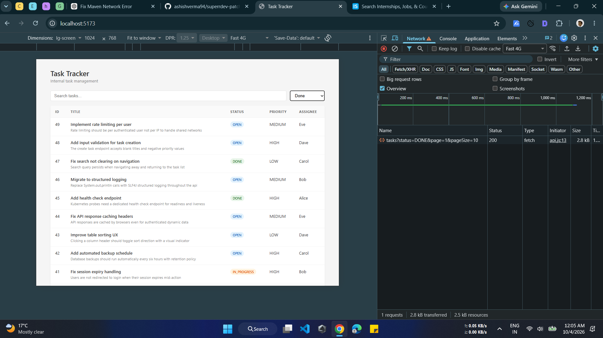
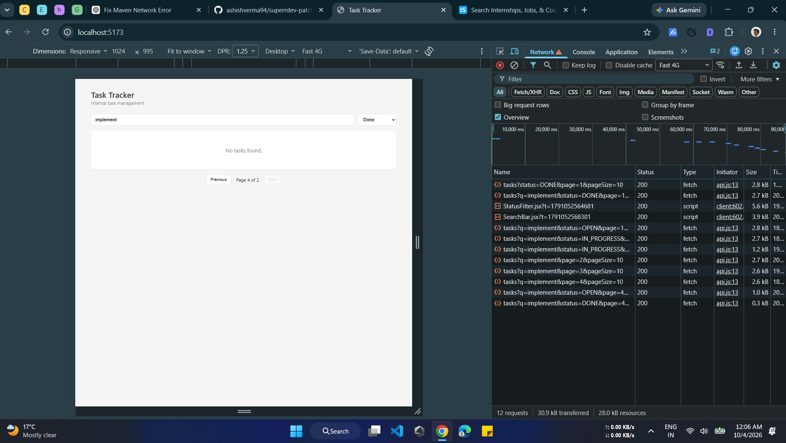
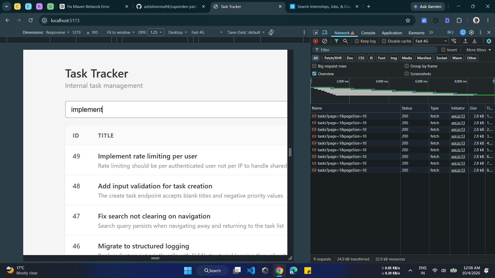
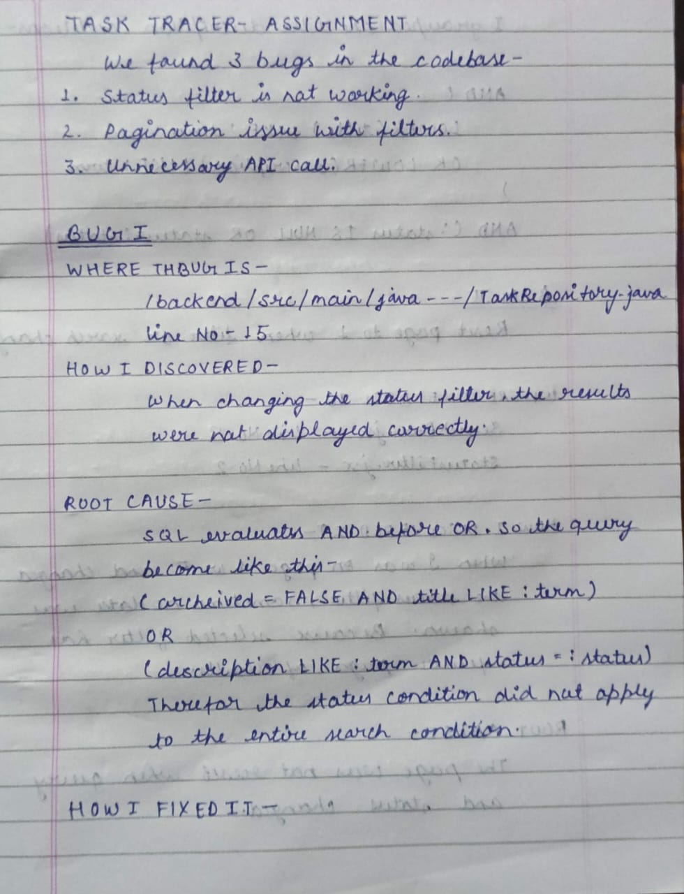
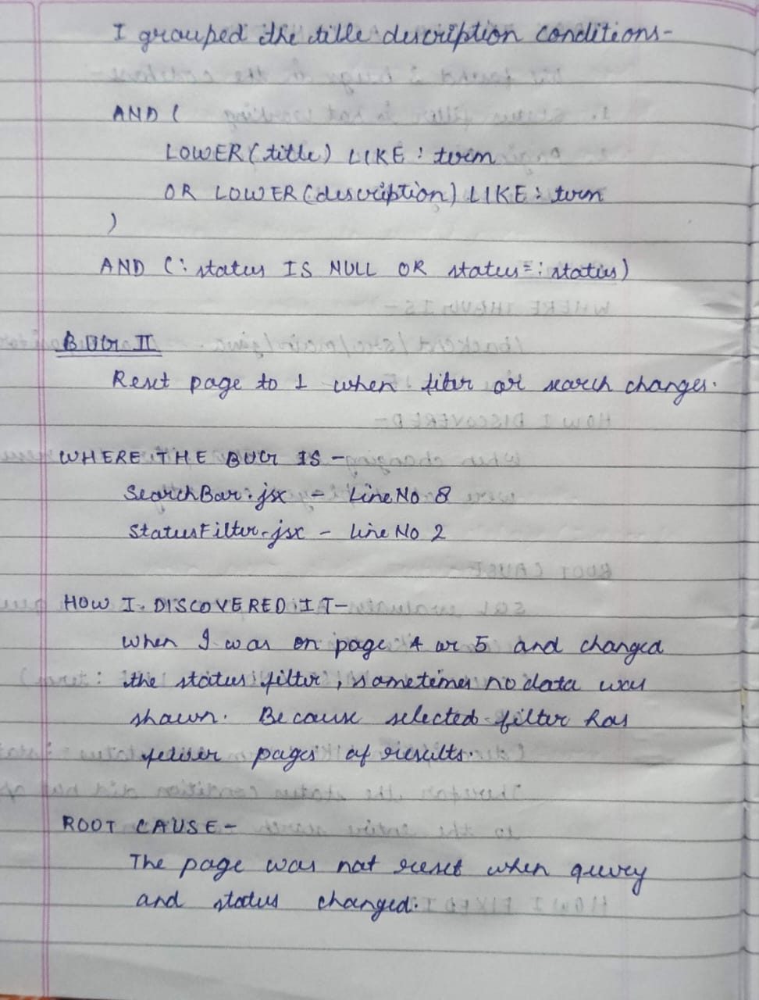
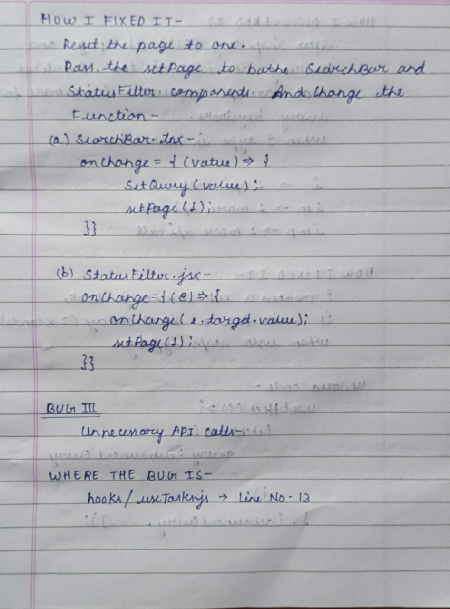
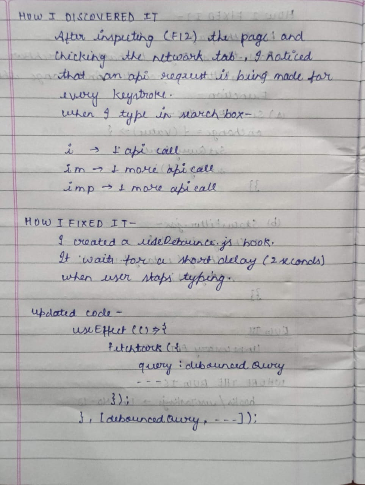
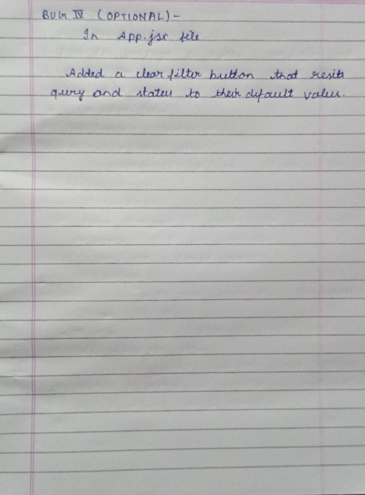

# Task Tracker --- Codebase Bug Notes

## 1. Status Filter is not working

### Location

-   **File:** `TaskRepository.java`
-   **Folder:** `Backed`

After checking the backend SQL query, the filtering logic was found to be incorrectly grouped.

**Screenshot:** Done filter is selected but data is showing for all three filters.

## 2. Pagination Not Resetting After Search/Filter Changes

### Location

-   **File:** `App.jsx`,`SearchBar.jsx` and `StatusFilter.jsx`
-   **Folder:** Frontend

**Screenshot:** See the selected-filter and empty-page screenshots in

## 3. Unnecessary API Calls During Search

### Where the bug is

-   **Location:** `useTasks.js` 
-   **Folder:** Frontend

**Screenshot:** See the search/API request inspection screenshot in

## 4. Clear Filters Button --- Optional Improvement

### Location

-   **File:** `App.jsx`
-   **Layer:** Frontend → User experience

### Issue

Users previously had to manually clear the search and status filter.

# Notes-

### AI Tool - 
 I used Chatgpt for fixing the sql query and writing the debounce hook.

